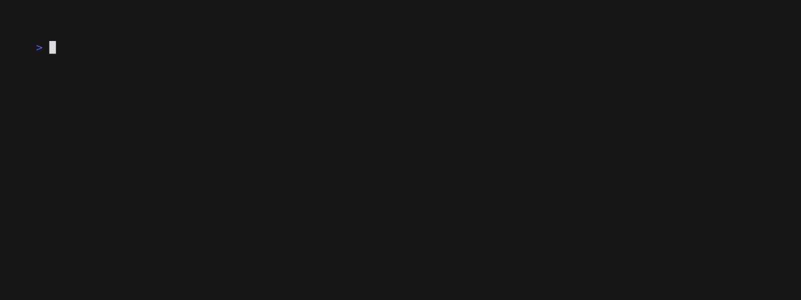

# Heatmap component for Bubbletea TUI Apps

This is a work in progress. I'm building it to learn how to use Charm Bubbletea and I welcome any feedback/help/tips/PR/bug reports!

The input for this component is an array of `CalDataPoints` which is a `{ Date time.Time Value float64}`. 

You can have multiple entries for a day and they'll be summed together. The division between dates is always calculated using the users's Local (what `time.Now()` returns.

### Current behavior/limitations

- Shows the previous one year from today
  - For now this means the width is fixed.
- Auto-normalizes the data for what is displayed
- Colors borrow the dark theme from Github's Contribution Heatmap and are fixed.
- View only. I'd like to be able to use this to select dates and perform actions in the app.
- Keybindings are hjkl and up/down/left/right.
